### 🤖 Smart EduBot – AI-Powered Multilingual Academic Assistant

Smart EduBot is a full-stack Flask-based AI academic assistant designed to simplify student–faculty interaction and resource access. It supports five Indian languages, retrieves study materials (PDFs, videos, audios), generates timetables, manages attendance and marks.

### ✨ Features

AI chatbot powered by NLP for natural-language interaction

Multilingual support (English, Kannada, Hindi, Tamil, Telugu)

Retrieve study materials by semester, branch, and subject

Timetable creation and visualization using Matplotlib

Attendance and marks management system

Student and lecturer authentication portals

Responsive, modern Bootstrap-based UI

### 🧠 Tech Stack
Layer	Technology
Frontend	HTML5, CSS3, Bootstrap 5, JavaScript
Backend	Python (Flask Framework)
Database	SQLite3
AI/NLP	TensorFlow, Googletrans API
Visualization	Matplotlib, Pandas
Email	Gmail SMTP
Version Control	Git & GitHub

--- 

### ⚙️ Setup Instructions

### 1. Clone the Repository
git clone https://github.com/harsha-0822/AI-Powered-Multilingual-Assistant.git

cd AI-Powered-Multilingual-Assistant

### 2. Create a Virtual Environment
python -m venv venv

venv\Scripts\activate       //Windows

or

source venv/bin/activate    //Linux/Mac

### 3. Install Dependencies
pip install -r requirements.txt

### 4. Run the Application
python app.py

### Then open your browser and go to:

http://127.0.0.1:5000/

 ---

## 📸 Screenshots

### 🏠 Home Page
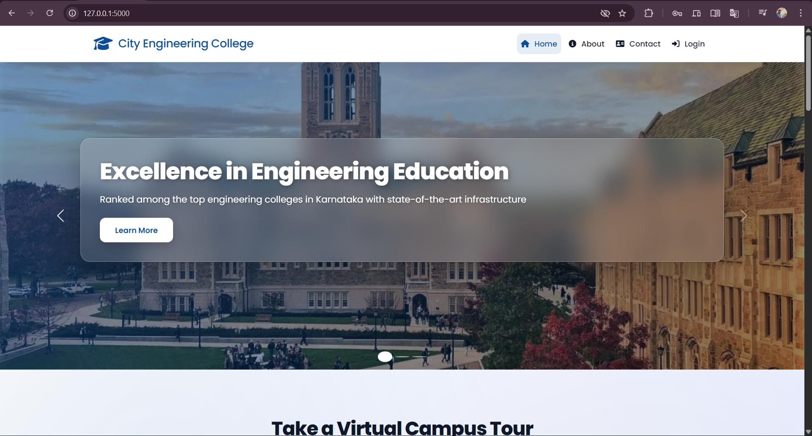

### 👨‍🎓 Student Login Page
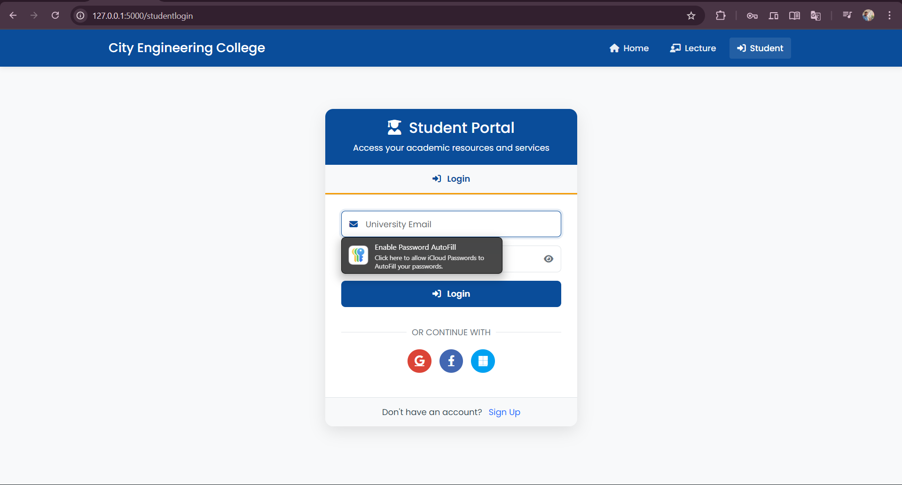

### 👩‍🏫 Lecture Login Page
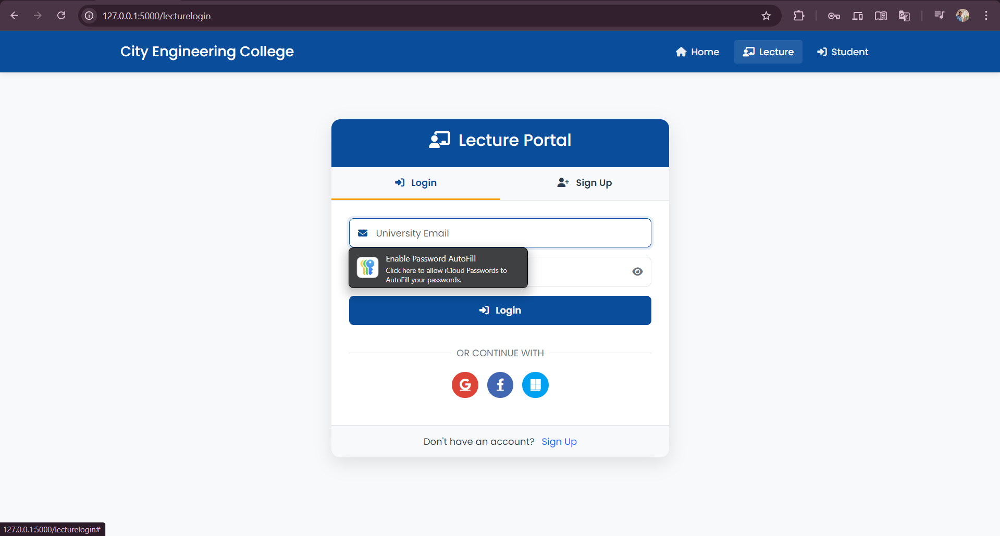

### 🤖 Chatbot Main Page
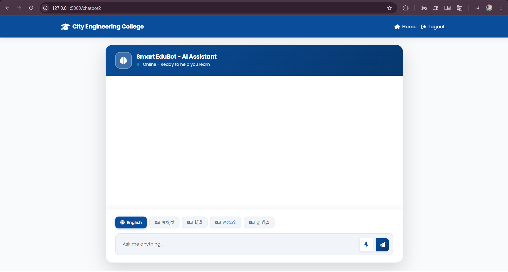

### 💬 Chatbot Response Example
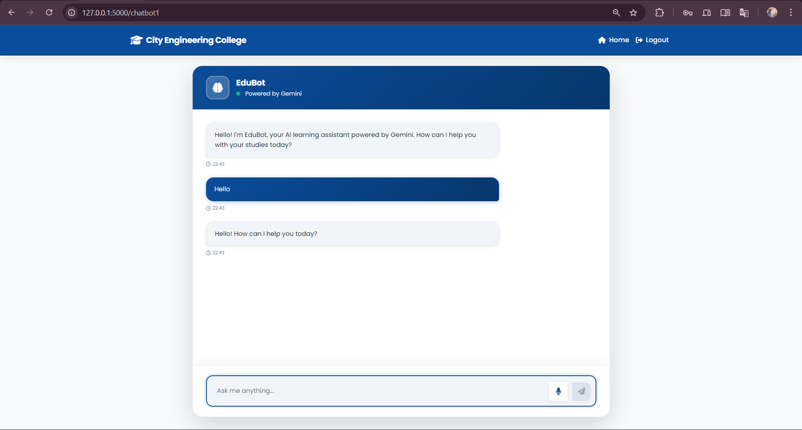

### 📚 Study Material Upload
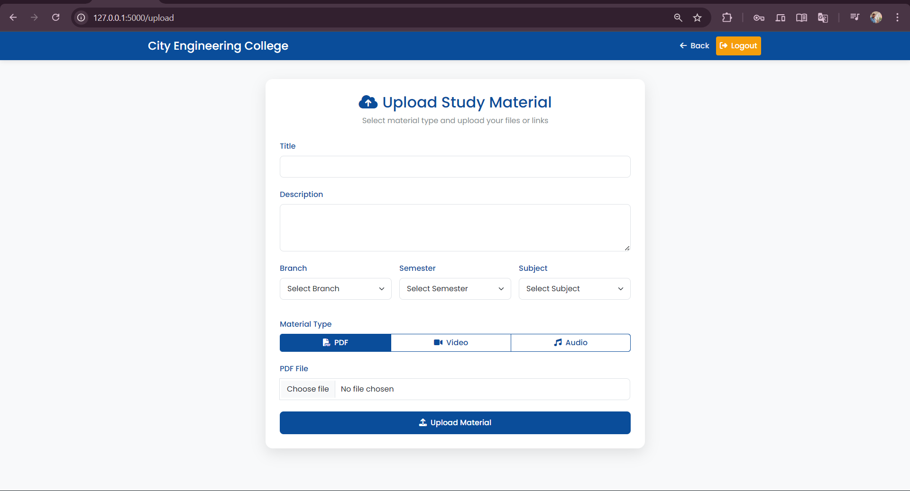

### 🕒 Timetable Management
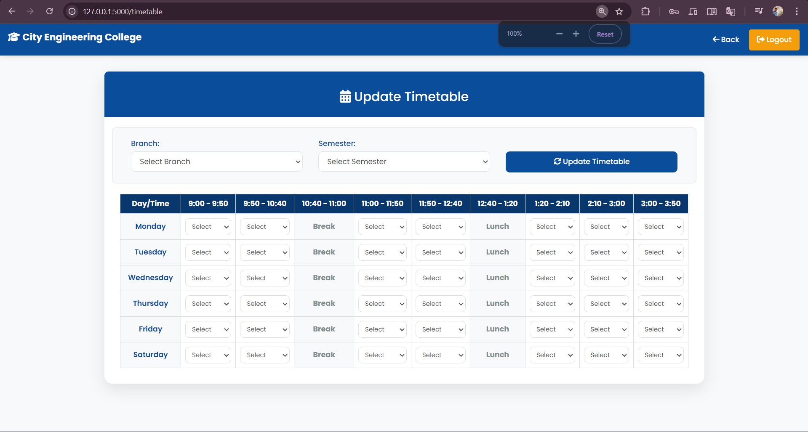

### 📊 Attendance Entry
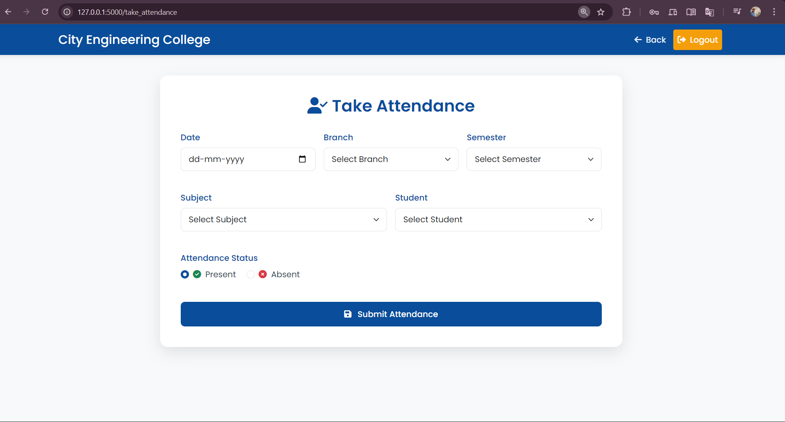

### 📊 Attendance View
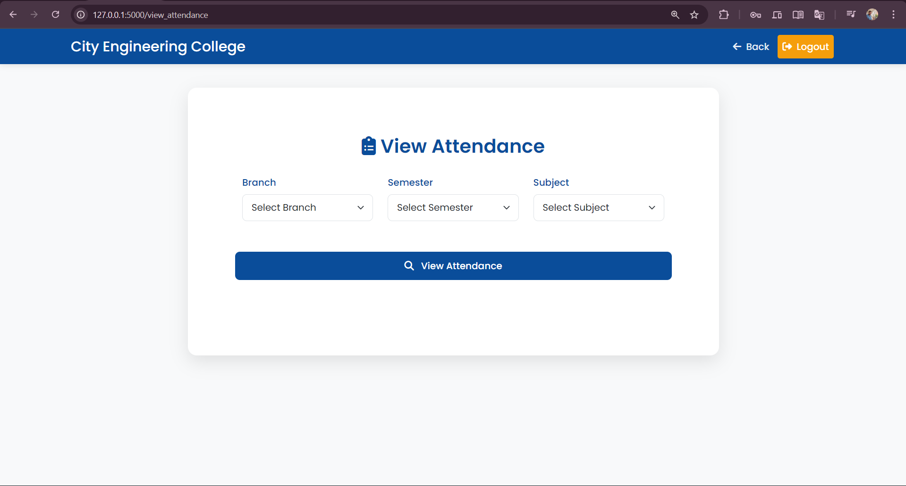

### 📈 Marks Entry
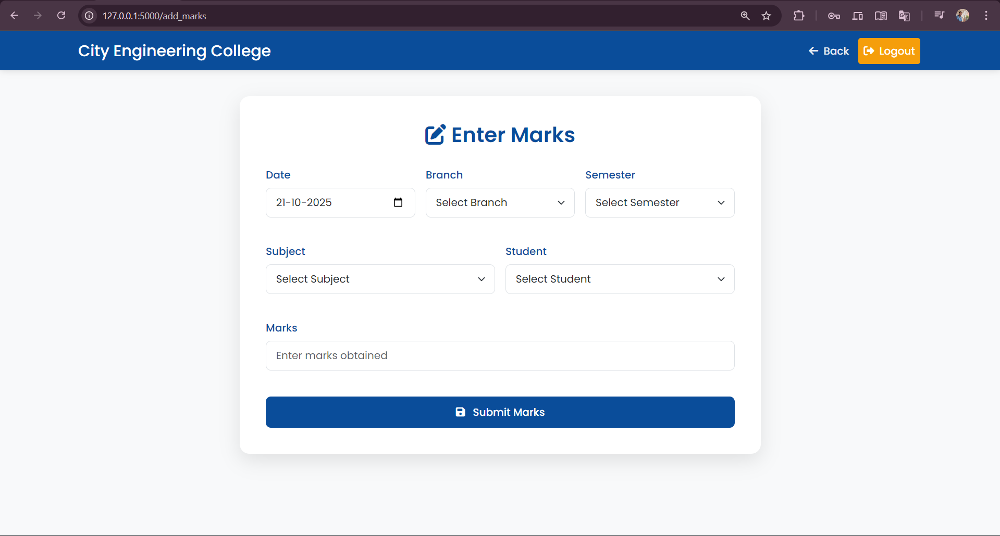

### 🤖 Receiving Video as output in Chatbot
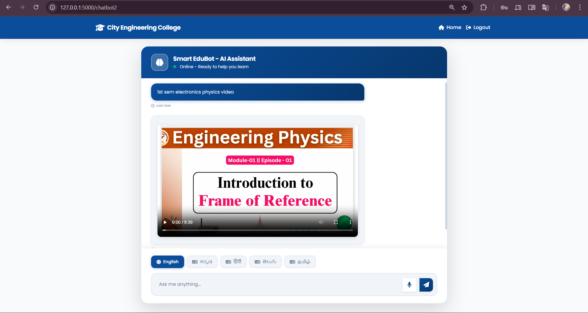

### 🤖 Receiving PDF as output in Chatbot
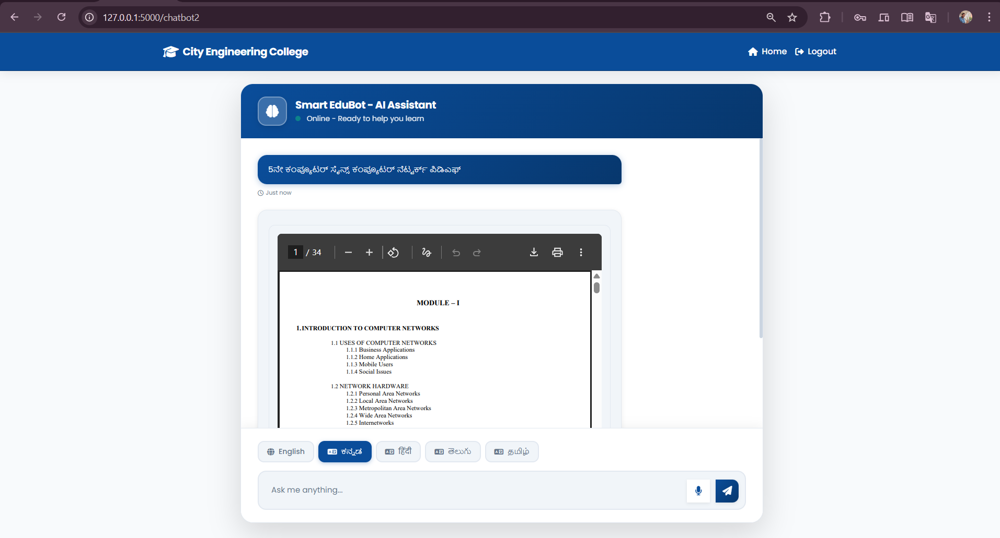

### 🤖 Receiving Audio as output in Chatbot
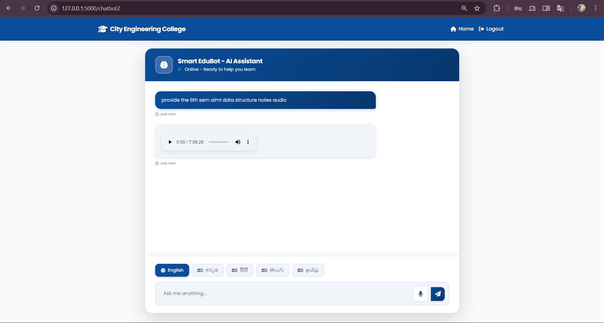

### 🕒 Timetable Update
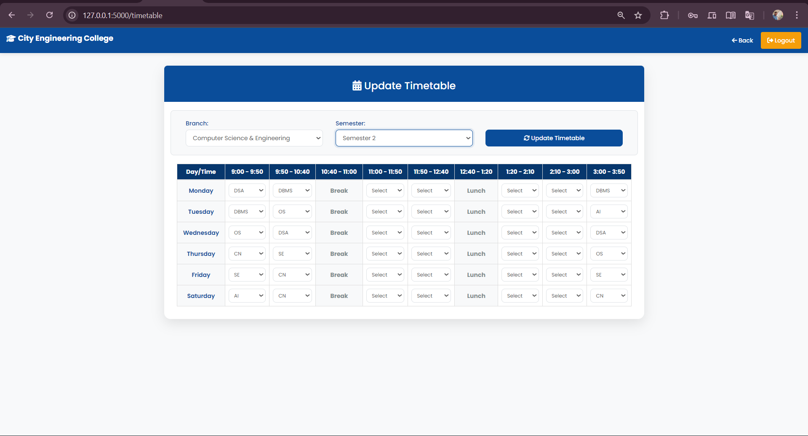

### 🤖 Receiving Timetable as output in Chatbot
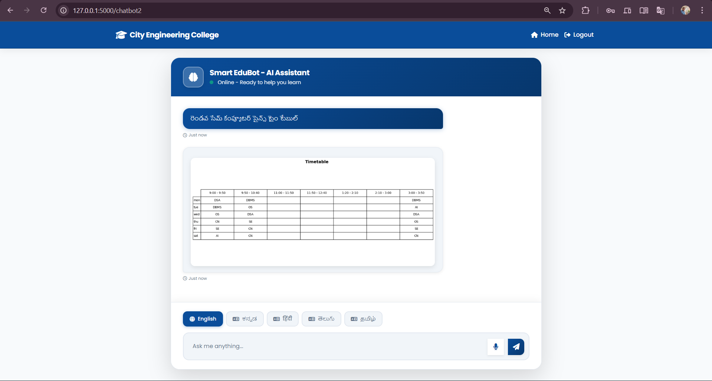

## 🧩 Example Chatbot Queries

Smart EduBot can understand natural-language queries in **any order**, as long as they include the required keywords.

---

### 🎯 Format Rules

#### 🧾 For Retrieving Study Materials:
Use the format **Semester, Branch, Subject, and Format (pdf/video/audio)** — in **any order**.  
Example Queries:
- `5th sem CSE Computer Networks PDF`
- `1st sem Electronics Physics Video`
- `6th sem AIML Data Structure Audio`
- `CSE 4th sem DBMS pdf`
- `AIML 8th sem NLP video`

---

#### 🕒 For Retrieving Timetable:
Use the format **Semester, Branch, and Timetable** — in **any order**.  
Example Queries:
- `7th sem CSE timetable`
- `AIML 6th sem timetable`
- `Timetable for 3rd sem ECE`
- `ECE 5th sem time table`

---

### 🌍 Supported Languages
Smart EduBot supports the following languages:
- English  
- Kannada  
- Hindi  
- Tamil  
- Telugu  

You can type queries in any of the above languages and get the same results.

---

### 🧠 Example Table

| Example Query | Response |
|----------------|-----------|
| 5th sem CSE Computer Networks PDF | Returns PDF notes |
| 1st sem Electronics Physics Video | Displays related video resource |
| 6th sem AIML Data Structures Audio | Plays audio material |
| 7th sem CSE Timetable | Generates and displays timetable image |
| Upcoming college events | Lists scheduled events from database |

---

### 👨‍💻 Developer Information

Name: Harsha Vardhan S M

Department: Computer Science & Engineering

College: City Engineering College

Project: AI-Powered Multilingual Assistant (Smart EduBot)
